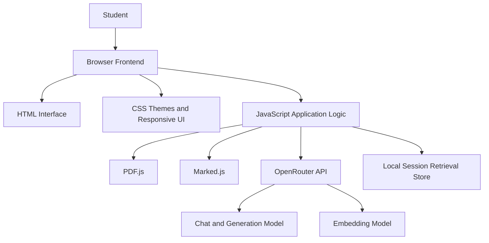
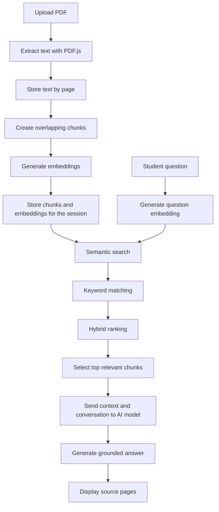
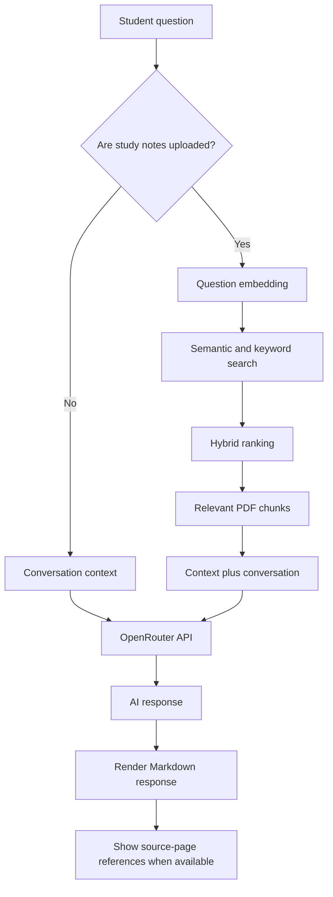
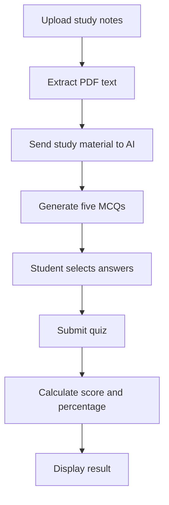
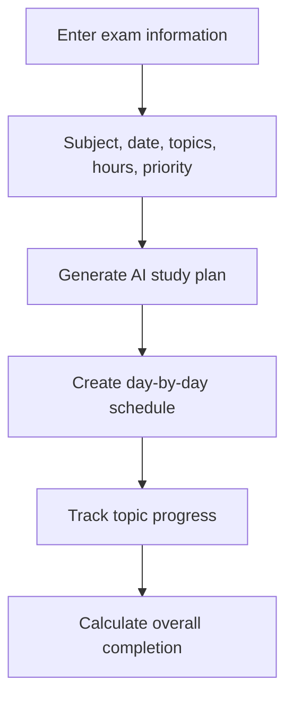

# StudyMate AI

> An AI-powered academic assistant that helps engineering students understand study material, generate practice quizzes, and create personalized study plans.

StudyMate AI combines conversational AI, browser-based PDF processing, semantic retrieval, and personalized planning in a student-focused study platform. It is implemented as a client-side web application using HTML, CSS, and JavaScript, with AI capabilities provided through OpenRouter.

## Overview

StudyMate AI helps students ask academic questions, upload and search their notes, receive document-grounded answers, generate quizzes, and organize exam preparation. The application is designed to support subjects such as data structures, algorithms, programming, computer science, and other engineering courses.

## Features

| Feature | Description |
|---|---|
| AI Study Assistant | Ask academic questions and receive formatted Markdown responses with conversation context. |
| PDF Study Notes | Upload PDF notes, extract text page by page, and retain source-page information. |
| Retrieval-Augmented Generation | Retrieve relevant sections from uploaded notes before generating an answer. |
| Hybrid Search | Combine semantic similarity with keyword relevance to improve retrieval quality. |
| Source References | View the PDF pages used to support a generated answer. |
| Quiz Generator | Generate five-question multiple-choice quizzes from uploaded study material. |
| Quiz Scoring | Calculate scores and percentages after quiz submission, with retry support. |
| Study Planner | Generate day-by-day revision schedules from exam dates, topics, priorities, and available study hours. |
| Progress Tracking | Track topic completion and overall study-plan progress. |
| Theme Support | Switch between dark and light themes. |
| Responsive Interface | Use the dashboard on desktop, laptop, tablet, and mobile screens. |

## Technology Stack

| Technology | Purpose |
|---|---|
| HTML5 | Application structure and accessible page content |
| CSS3 | Responsive layout, themes, animations, and dashboard styling |
| JavaScript | Application logic, API communication, retrieval, quizzes, and planning |
| PDF.js | Client-side PDF text extraction [1] |
| Marked.js | Markdown rendering in the chat interface [2] |
| OpenRouter | AI API gateway [3] |
| GPT-OSS-20B | Chat, quiz, and study-plan generation |
| `text-embedding-3-small` | Semantic embedding generation |
| Git and GitHub | Version control and repository hosting |
| Vercel | Static frontend deployment [4] |

## Architecture

StudyMate AI is organized as a browser-based frontend. The HTML interface presents the dashboard, CSS controls presentation and responsiveness, and JavaScript coordinates document processing, retrieval, AI requests, quizzes, planning, and progress tracking.



## Retrieval-Augmented Generation (RAG)

When study notes are uploaded, the application extracts text from each PDF page, divides the text into smaller overlapping chunks, generates an embedding for each chunk, and stores the resulting data for the active browser session.

When a student asks a question, the question is embedded and compared with the stored chunk embeddings using cosine similarity. Keyword relevance is also calculated so that exact technical terms receive additional weight. The highest-ranking chunks are supplied to the AI model as context, allowing the answer to remain grounded in the uploaded notes.

The hybrid score is calculated as follows:

```text
Hybrid Score = 0.8 × Semantic Similarity + 0.2 × Keyword Score
```

The retrieval process returns the top three relevant chunks by default. Each chunk retains its originating page number so that the interface can display source-page references alongside the response.

### RAG Workflow



A stored chunk follows this general shape:

```javascript
{
  text: "Relevant extracted text...",
  page: 8,
  embedding: [/* vector values */]
}
```

## AI Chat Flow

Without uploaded notes, the assistant sends the student's question and conversation context to the configured AI model. With uploaded notes, the application performs retrieval first and then sends the selected context together with the conversation history.



## Quiz Generation

The quiz feature uses uploaded study material to generate five multiple-choice questions. Each question contains four answer choices and a correct answer. After submission, the application calculates the student's score and percentage and allows the quiz to be attempted again.



## Study Planner

Students can create a personalized revision plan by entering a subject or course, examination date, topics, available study hours per day, and priority information. The AI converts these inputs into a practical day-by-day schedule, while the interface provides topic-level and overall completion tracking.



## Project Structure

```text
StudyMate-AI/
├── index.html       # Main application interface
├── style.css        # Themes, layout, responsive styling, and animations
├── script.js        # Chat, PDF processing, RAG, quizzes, planning, and progress logic
├── config.js        # Local API configuration; do not commit this file
├── README.md        # Project documentation
├── .gitignore       # Ignored files and secrets
└── favicon.ico      # Browser tab icon
```

### File Responsibilities

`index.html` contains the dashboard interface, including navigation, the AI assistant, study notes, quiz area, study planner, and progress tracker.

`style.css` defines the visual system, including dark and light themes, responsive layouts, cards, buttons, navigation, chat components, quiz components, planner components, loading states, and animations.

`script.js` contains the main application behavior: AI communication, conversation management, PDF processing, chunking, embedding generation, semantic retrieval, hybrid ranking, source references, quiz generation, scoring, study-plan generation, and progress tracking.

`config.js` stores the local API configuration and must remain untracked. For a production deployment, API calls should be moved to a backend or serverless function so that credentials are not exposed in the browser.

## Getting Started

### Prerequisites

You need a modern web browser, Git, an OpenRouter API key, and a local static-file development server. A VS Code installation with the Live Server extension is sufficient for local testing.

### Installation

1. Clone the repository:

   ```bash
   git clone YOUR_GITHUB_REPOSITORY_URL
   cd StudyMate-AI
   ```

2. Create a local `config.js` file in the project root:

   ```javascript
   const API_KEY = "YOUR_OPENROUTER_API_KEY";
   ```

3. Confirm that the local configuration file is ignored by Git:

   ```gitignore
   config.js
   .env
   node_modules/
   .DS_Store
   ```

4. Start a local development server. For example, with VS Code, install Live Server, right-click `index.html`, and select **Open with Live Server**.

5. Open the local URL displayed by the development server and verify that the chat, PDF upload, quiz, and planner features are available.

## API Configuration

The application uses OpenRouter for AI requests. The configured model is responsible for chat, quiz, and study-plan generation, while the embedding model is used for semantic retrieval.

Do not hard-code a real API key into files that are committed to GitHub. The client-side configuration approach is suitable for educational demonstrations and local prototypes only. For production use, create a backend or serverless API route that stores the key securely and proxies requests from the frontend.

## Deployment with Vercel

StudyMate AI can be deployed as a static frontend application.

| Vercel setting | Value |
|---|---|
| Framework preset | Other |
| Build command | Leave empty |
| Output directory | Leave empty |
| Install command | Leave empty |

Before deploying, remove any real API keys from the repository and use a secure server-side integration instead. A publicly exposed browser key can be copied and misused by anyone who visits the application.

## Privacy and Data Handling

PDF files are processed in the browser using PDF.js. The application extracts text from uploaded documents and uses relevant retrieved content for AI processing. The basic workflow does not require permanent server-side PDF storage, and embeddings are retained only for the active browser session.

Users should avoid uploading confidential, personal, or sensitive documents to an AI-enabled application unless the application's data-handling and provider policies have been reviewed.

## Error Handling

The application is designed to handle common failure cases, including empty chat messages, invalid PDF files, PDF extraction failures, failed API requests, missing AI responses, incomplete planner fields, and invalid quiz data.

A typical API request should validate the response before attempting to use the returned data:

```javascript
if (!response.ok) {
  throw new Error(
    data.error?.message || "API request failed"
  );
}
```

## Current Limitations

The current version is primarily client-side. API-key protection requires a backend or serverless architecture for production. PDF processing is limited to text that PDF.js can extract, so scanned or image-only PDFs may require OCR. Embeddings are stored only during the active browser session, large PDFs may require optimization, and AI output depends on the availability and behavior of the selected model and API provider.

## Future Improvements

Potential improvements include secure backend API routes, user authentication, cloud storage for notes, a persistent vector database, a more advanced retrieval pipeline, OCR support for scanned PDFs, voice interaction, detailed learning analytics, gamification, multiple PDF collections, saved answers and bookmarks, calendar integration, study reminders, Progressive Web App support, and collaborative study rooms.

## Screenshots

Add screenshots of the completed application to a `screenshots/` directory and update the paths below:

| Area | Image |
|---|---|
| AI Assistant | `` |
| Study Notes | `` |
| Quiz Arena | `` |
| Study Planner | `` |

## Example Use Case

A student preparing for a Data Structures examination can upload lecture notes, allow StudyMate AI to extract and index the material, and ask a question such as “What is the difference between BFS and DFS?” The system retrieves the most relevant sections, generates a context-aware answer, and provides source-page references. The student can then generate a five-question quiz and create a personalized revision plan using the examination date, topics, priorities, and available study hours.

## Project Highlights

This project demonstrates practical use of artificial intelligence, large language models, Retrieval-Augmented Generation, vector embeddings, semantic search, hybrid information retrieval, PDF processing, prompt engineering, frontend development, API integration, interactive UI design, study analytics, and personalized AI applications.

The main concepts demonstrated are:

```text
Large Language Models
├── Prompt engineering
├── Conversation memory
└── Context injection

Retrieval-Augmented Generation
├── Document processing
├── Text chunking
├── Embeddings
├── Similarity search
└── Context retrieval

AI Applications
├── Question answering
├── Quiz generation
└── Personalized planning
```

## Project Status

**Status: Completed**

StudyMate AI is a completed AI-powered academic assistant demonstrating an end-to-end implementation of document-grounded question answering, interactive quizzes, and personalized study planning.

## Author

**Vedant Singh**  
Engineering Student | AI and Software Development Enthusiast

## Acknowledgements

- [OpenRouter](https://openrouter.ai/) for AI API access.
- [PDF.js](https://mozilla.github.io/pdf.js/) for client-side PDF processing.
- [Marked](https://marked.js.org/) for Markdown rendering.
- [Vercel](https://vercel.com/) for deployment.
- [GitHub](https://github.com/) for version control and project hosting.

## License

This project is intended for educational and portfolio purposes. Add an appropriate open-source license, such as the MIT License, before distributing the project publicly.

## References

[1]: https://mozilla.github.io/pdf.js/ "PDF.js documentation"
[2]: https://marked.js.org/ "Marked documentation"
[3]: https://openrouter.ai/docs "OpenRouter documentation"
[4]: https://vercel.com/docs "Vercel documentation"

---

Built as a practical demonstration of AI-assisted learning and document-grounded study workflows.
